# Scrum Poker - Master Application Flow

> [!CAUTION]
> **MANDATORY REFERENCE** - Any agent coding on this project MUST follow this flow exactly. Do not deviate without explicit user approval.

---

## 1. Application Overview

Scrum Poker is a real-time planning poker application with Jira integration. It has **two user types**:
1. **Admin** (authenticated user) - Full dashboard with sprint management
2. **Guest** (invited player) - Limited view for voting only

---

## 2. Complete Application Flow Diagram

```mermaid
flowchart TB
    subgraph "Authentication Flow"
        A[User visits URL] --> B{Login or Signup?}
        B --> |Signup| C[Email + Password + Confirm + Invite Code]
        C --> D{Valid Invite Code?}
        D --> |No| E[❌ Cannot signup]
        D --> |Yes| F[✅ Account Created]
        B --> |Login| G[Email + Password]
        G --> H[Token Created]
        H --> I[Immediately fetch Jira Boards]
    end
    
    subgraph "Board Selection"
        I --> J[Show Board Selection Card]
        J --> K[Dropdown: All boards from Jira\ne.g., GDT-123, SPRINT-456]
        K --> L[Admin selects a Board]
    end
    
    subgraph "Admin Dashboard - 30% Left Panel"
        L --> M[Show Sprint/Space List]
        M --> N1[Active Sprint - 🔴 Red Dot]
        M --> N2[Incomplete Sprints - Greyed/Disabled]
        M --> N3[Completed Sprints - Disabled]
        N2 --> O[3-dot Menu → Enable Sprint]
    end
    
    subgraph "Admin Dashboard - 70% Right Panel - Planning Poker"
        N1 --> P[Click Sprint → Fetch Issues]
        P --> Q[Display First Issue on Table]
        Q --> R[Team Votes]
        R --> S[Reveal Cards]
        S --> T{Issue Type?}
        T --> |Story| U[Assign Story Points Button]
        T --> |Bug| V[Estimate Time Button]
        S --> W[Show Assignee or Assign Button]
    end
    
    subgraph "Invite Flow"
        L --> X[Invite Button in Navbar]
        X --> Y[Popup with Room Link]
        Y --> Z[Guest clicks link]
        Z --> AA[Card: Board Name + Sprint Name]
        AA --> AB[Enter Display Name]
        AB --> AC[Join Room - Limited View]
        AC --> AD[Only sees Table + Can Vote + Reveal]
    end
```



---

## 3. Two Types of Users - Permission Matrix

| Feature | Admin (Logged In) | Guest (Invited) |
|---------|------------------|-----------------|
| **Login/Signup** | ✅ Required | ❌ Not needed |
| **Access** | Full dashboard | Planning poker only |
| **Sprint List** | ✅ Can see all | ❌ Hidden |
| **Switch Sprints** | ✅ Yes | ❌ No |
| **Enable/Disable Sprints** | ✅ Yes | ❌ No |
| **Jira Sync** | ✅ Yes | ❌ No |
| **Vote on Cards** | ✅ Yes | ✅ Yes |
| **Reveal Cards** | ✅ Yes | ✅ Yes |
| **Navigate Issues** | ✅ Yes | ❌ No |
| **Assign Story Points** | ✅ Yes | ❌ No |
| **Estimate Time (Bug)** | ✅ Yes | ❌ No |
| **Assign Ticket** | ✅ Yes | ❌ No |
| **Create Invite Link** | ✅ Yes | ❌ No |

---

## 4. Detailed Screen Breakdown

### Screen 1: Landing Page (`/`)
- Two buttons: **Login** | **Signup**
- Premium, animated UI with gradient background

### Screen 2: Signup Form (`/signup`)
- Email (required)
- Password (required, min 8 chars)
- Confirm Password (required, must match)
- **Invite Code** (REQUIRED - only invited users can signup)

### Screen 3: Login Form (`/login`)
- Email (required)
- Password (required)
- → On Success:
  - Token created and stored
  - **Immediately call Jira API to fetch boards**
  - Redirect to Board Selection

### Screen 4: Board Selection (`/select-board`)
- Card with dropdown selector
- Lists all Jira boards: `[BOARD-ID] Board Name` (e.g., `[GDT-123] GDT Sprint Board`)
- Admin selects one
- → Redirect to Dashboard with selected boardId

### Screen 5: Admin Dashboard (`/dashboard`) - Split View

```
┌────────────────────────────────────────────────────────────────────────┐
│ [Logo]  Room Name          [🟢 Online]    [Invite Player]   [UserName] │
├─────────────────────┬──────────────────────────────────────────────────┤
│                     │                                                  │
│   SPRINTS (30%)     │           PLANNING POKER (70%)                   │
│                     │                                                  │
│   🔴 Sprint 1       │    ┌────────────────────────────────────────┐    │
│      (Active)       │    │  ISSUE: GDT-123                        │    │
│                     │    │  "Implement user login functionality"  │    │
│   ○ Sprint 2        │    │  Type: Story | Assignee: John Doe      │    │
│     [Disabled]      │    └────────────────────────────────────────┘    │
│     ⋮ → Enable      │                                                  │
│                     │              🪑   🪑   🪑   🪑                    │
│   ○ Sprint 3        │                                                  │
│     [Disabled]      │          🪑       TABLE       🪑                 │
│     ⋮ → Enable      │                                                  │
│                     │              🪑   🪑   🪑   🪑                    │
│                     │                                                  │
│                     │    [Reveal] [Reset] [← Prev Issue] [Next →]      │
│                     │                                                  │
│                     │    ┌─────────────────────────────────────────┐   │
│                     │    │ [Assign Ticket ▼]  [Set Points: ___]    │   │
│                     │    │  OR if Bug:        [Estimate Time: ___] │   │
│                     │    └─────────────────────────────────────────┘   │
├─────────────────────┴──────────────────────────────────────────────────┤
│   Card Deck:  [1]  [2]  [3]  [5]  [8]  [13]  [21]  [?]                 │
└────────────────────────────────────────────────────────────────────────┘
```

**Left Panel (30%):**
- List of all sprints for selected board
- 🔴 Red dot indicator for active sprint (from Jira `state: 'ACTIVE'`)
- Incomplete/non-active sprints are **greyed out and disabled**
- 3-dot menu (`⋮`) at flex-end of each disabled sprint
- Menu option: "Enable Sprint" to manually enable

**Right Panel (70%):**
- Current issue display (key, summary, type, assignee)
- Planning Poker table with team seats
- Card deck for voting
- Control buttons: Reveal, Reset, Prev, Next
- Post-reveal actions:
  - **Assign Ticket** dropdown (if unassigned) OR show current assignee name
  - **Set Story Points** input (for Story types) → syncs to Jira
  - **Estimate Time** input (for Bug types) → syncs to Jira

### Screen 6: Invite Popup
- Modal/popup triggered by "Invite Player" button
- Shows room link: `/join/{sessionId}`
- sessionId encodes: boardId + sprintId + createdBy
- Copy button to clipboard

### Screen 7: Guest Join Page (`/join/:sessionId`)
- Shows: Board/Room Name + Sprint/Space Name
- Input: Display Name
- Button: "Enter Room"
- → On submit: Joins WebSocket room with LIMITED VIEW

### Screen 8: Guest Planning View (`/room/:sessionId`)

```
┌────────────────────────────────────────────────────────────────────────┐
│ [Logo]  Sprint 1 - GDT Board              [🟢 Online]       [GuestName]│
├────────────────────────────────────────────────────────────────────────┤
│                                                                        │
│    ┌────────────────────────────────────────┐                          │
│    │  ISSUE: GDT-123                        │                          │
│    │  "Implement user login functionality"  │                          │
│    └────────────────────────────────────────┘                          │
│                                                                        │
│                     🪑   🪑   🪑   🪑                                   │
│                                                                        │
│                 🪑       TABLE       🪑                                │
│                                                                        │
│                     🪑   🪑   🪑   🪑                                   │
│                                                                        │
│                    [Reveal Cards]                                      │
│                                                                        │
│  ❌ NO Sprint list (left panel hidden)                                 │
│  ❌ NO Assign ticket button                                            │
│  ❌ NO Set points button                                               │
│  ❌ NO Next/Prev issue buttons                                         │
│                                                                        │
├────────────────────────────────────────────────────────────────────────┤
│   Card Deck:  [1]  [2]  [3]  [5]  [8]  [13]  [21]  [?]                 │
└────────────────────────────────────────────────────────────────────────┘
```

---

## 5. Database Schemas

### Admin Model (server/src/models/Admin.ts)

```typescript
// CURRENT SCHEMA (needs updates)
interface IAdmin {
    email: string;           // Required, unique, lowercase
    password: string;        // Required, min 8 chars, hashed with bcrypt
    displayName: string;     // Required
    companyId: string;       // Required, default 'siemens'
    createdAt: Date;
}

// ❌ MISSING FIELDS TO ADD:
interface IAdmin {
    email: string;
    password: string;
    displayName: string;
    companyId: string;
    inviteCode: string;      // ⬅️ ADD: Unique code for inviting others
    invitedBy?: string;      // ⬅️ ADD: Who invited this user (userId)
    selectedBoardId?: string; // ⬅️ ADD: Last selected board for UX
    role?: 'admin' | 'user'; // ⬅️ ADD: Future scalability
    createdAt: Date;
}
```

### Sprint Model (server/src/models/Sprint.ts)

```typescript
// CURRENT SCHEMA (needs updates)
interface ISprint {
    sprintId: string;
    sprintName: string;
    boardId: string;
    shareableCode: string;
    status: 'active' | 'completed';
    tickets: ITicket[];
    createdAt: Date;
    completedAt?: Date;
}

// ❌ MISSING FIELDS TO ADD:
interface ISprint {
    sprintId: string;
    sprintName: string;
    boardId: string;
    shareableCode: string;
    status: 'active' | 'completed';
    isEnabled: boolean;      // ⬅️ ADD: Manual enable/disable by admin
    jiraState: 'FUTURE' | 'ACTIVE' | 'CLOSED'; // ⬅️ ADD: From Jira
    currentIssueIndex: number; // ⬅️ ADD: Track which issue is being voted
    tickets: ITicket[];
    createdAt: Date;
    completedAt?: Date;
}
```

### Ticket Schema (embedded in Sprint)

```typescript
interface ITicket {
    issueKey: string;        // e.g., "GDT-123"
    summary: string;
    description?: string;
    issueType: 'Story' | 'Bug' | 'Task' | 'Sub-task'; // From Jira
    jiraUrl: string;
    assignee?: {
        accountId: string;
        displayName: string;
    };
    currentPoints?: number;
    votingRounds: IVotingRound[];
}

interface IVotingRound {
    roundNumber: number;
    votes: IVotingRecord[];
    average?: number;
    agreement?: number;
    finalPoints?: number;
    revealedAt?: Date;
    updatedInJira: boolean;
}

interface IVotingRecord {
    participantName: string;
    participantId: string;
    vote: string | number;
    votedAt: Date;
}
```

### InviteSession Model (NEW - server/src/models/InviteSession.ts)

```typescript
// ❌ NEW MODEL TO CREATE
interface IInviteSession {
    sessionId: string;       // Unique shareable code (in URL)
    boardId: string;
    boardName: string;
    sprintId: string;
    sprintName: string;
    createdBy: string;       // Admin userId
    createdAt: Date;
    expiresAt?: Date;        // Optional expiry
    isActive: boolean;
}
```

### Guest Participant (In-Memory/Session)

```typescript
// For tracking invited players in room (in-memory store)
interface IGuestParticipant {
    sessionId: string;
    displayName: string;
    joinedAt: Date;
    socketId: string;
    isGuest: true;  // Flag to identify guests
}
```

---

## 6. API Endpoints

### Auth Routes (`/api/v1/auth`)

| Method | Endpoint | Auth | Description |
|--------|----------|------|-------------|
| POST | `/signup` | ❌ | Signup with invite code |
| POST | `/login` | ❌ | Login, get JWT token |
| GET | `/me` | ✅ | Get current user |
| POST | `/validate-invite` | ❌ | Check if invite code is valid (NEW) |
| GET | `/my-invite-code` | ✅ | Get logged-in user's invite code (NEW) |

### Jira Routes (`/api/jira`)

| Method | Endpoint | Auth | Description |
|--------|----------|------|-------------|
| GET | `/test` | ✅ | Test Jira connection |
| GET | `/boards` | ✅ | Get all boards (**call immediately on login**) |
| GET | `/boards/:boardId` | ✅ | Get board details |
| GET | `/boards/:boardId/sprints` | ✅ | Get sprints for board |
| GET | `/boards/:boardId/active-sprint` | ✅ | Get active sprint |
| GET | `/sprints/:sprintId/issues` | ✅ | Get issues for sprint |
| GET | `/issues/:issueKey` | ✅ | Get issue details |
| PUT | `/issues/:issueKey/story-points` | ✅ | Update story points |
| PUT | `/issues/:issueKey/assign` | ✅ | Assign issue to user |
| POST | `/issues/:issueKey/comment` | ✅ | Add comment |
| POST | `/search` | ✅ | Search with JQL |

### Session Routes (`/api/v1/sessions`) - NEW TO CREATE

| Method | Endpoint | Auth | Description |
|--------|----------|------|-------------|
| POST | `/` | ✅ | Create invite session (boardId, sprintId) |
| GET | `/:sessionId` | ❌ | Get session info (for guest join page) |
| DELETE | `/:sessionId` | ✅ | Revoke/delete session |

### Sprint Routes (`/api/v1/sprints`) - NEW TO CREATE

| Method | Endpoint | Auth | Description |
|--------|----------|------|-------------|
| PATCH | `/:sprintId/enable` | ✅ | Enable a sprint |
| PATCH | `/:sprintId/disable` | ✅ | Disable a sprint |

---

## 7. WebSocket Events

### Client → Server Events

| Event | Payload | Description |
|-------|---------|-------------|
| `join_room` | `{roomId, userId, displayName, isScrumMaster, roomName}` | Admin joins room |
| `join_as_guest` | `{sessionId, displayName}` | Guest joins via invite link (NEW) |
| `select_card` | `{roomId, userId, card}` | Submit vote |
| `reveal_cards` | `{roomId}` | Reveal all votes |
| `reset_round` | `{roomId}` | Reset voting for same issue |
| `next_issue` | `{roomId}` | Move to next issue (NEW) |
| `prev_issue` | `{roomId}` | Move to previous issue (NEW) |
| `assign_points` | `{roomId, issueKey, points}` | Assign story points (NEW) |
| `estimate_time` | `{roomId, issueKey, time}` | Estimate time for bug (NEW) |
| `assign_ticket` | `{roomId, issueKey, accountId}` | Assign ticket to user (NEW) |

### Server → Client Events

| Event | Payload | Description |
|-------|---------|-------------|
| `room_update` | `{roomId, roomName, participants[], currentRound, areCardsRevealed}` | Full state sync |
| `vote_update` | `{userId, hasVoted}` | Someone voted |
| `cards_revealed` | `{participants[]}` | All votes revealed |
| `round_reset` | `{currentRound, participants[]}` | New round started |
| `issue_changed` | `{issue, issueIndex, totalIssues}` | Current issue changed (NEW) |
| `jira_synced` | `{issueKey, field, value, success}` | Jira update confirmed (NEW) |
| `error` | `{message}` | Error occurred |

---

## 8. Frontend Routes

| Route | Auth | Component | Description |
|-------|------|-----------|-------------|
| `/` | ❌ | LandingPage | Login/Signup buttons |
| `/login` | ❌ | LoginPage | Email + Password form |
| `/signup` | ❌ | SignupPage | Email + Password + Confirm + Invite Code |
| `/select-board` | ✅ | BoardSelectPage | Dropdown to choose board |
| `/dashboard` | ✅ | DashboardPage | 30/70 split with sprint list + poker |
| `/join/:sessionId` | ❌ | GuestJoinPage | Display name input for guests |
| `/room/:sessionId` | ❌ | GuestRoomPage | Limited poker view for guests |

---

## 9. Implementation Status Checklist

### ✅ COMPLETED (Already Built)

| Component | Status | Details |
|-----------|--------|---------|
| **Admin Model** | ✅ Done | email, password, displayName, companyId |
| **Company Model** | ✅ Done | companyId, displayName, jiraHost, jiraBase |
| **Sprint Model** | ✅ Done | sprintId, sprintName, boardId, shareableCode, tickets[], votingRounds[] |
| **Ticket Schema** | ✅ Done | issueKey, summary, issueType, votingRounds[] |
| **Auth Service** | ✅ Done | signup, login, generateToken, verifyToken |
| **Auth Middleware** | ✅ Done | JWT verification |
| **Auth Routes** | ✅ Done | /signup, /login, /me |
| **Jira Service** | ✅ Done | getBoards, getSprints, getSprintIssues, getIssue |
| **Jira Routes** | ✅ Done | All CRUD + update story points + assign |
| **Socket.IO Basic** | ✅ Done | join_room, select_card, reveal_cards, reset_round |
| **Planning Poker UI** | ✅ Done | Table, CardDeck, VotingResults |
| **In-Memory Room Store** | ✅ Done | rooms Map, participants |

### ❌ PENDING (Needs Implementation)

| Feature | Priority | Description |
|---------|----------|-------------|
| **Invite Code System** | 🔴 High | inviteCode field in Admin, validation during signup |
| **Confirm Password** | 🔴 High | Frontend form validation |
| **Auto Fetch Boards on Login** | 🔴 High | Call Jira API immediately after login success |
| **Board Selection UI** | 🔴 High | Dropdown card to select board |
| **Admin Dashboard Layout** | 🔴 High | 30/70 split view |
| **Sprint List Panel** | 🔴 High | Left panel with all sprints |
| **Active Sprint Indicator** | 🟡 Medium | Red dot for active Jira sprint |
| **Sprint Enable/Disable** | 🟡 Medium | 3-dot menu functionality |
| **Issue Navigation** | 🔴 High | Navigate through sprint issues |
| **Issue Type Detection** | 🟡 Medium | Bug vs Story distinction |
| **Story Points Button** | 🔴 High | Assign points after reveal |
| **Time Estimation Button** | 🟡 Medium | For bugs |
| **Assignee Display/Button** | 🔴 High | Show or assign |
| **Invite Link Generator** | 🔴 High | Create shareable link with roomId + sprintId |
| **Guest Join Page** | 🔴 High | Display name input, limited view |
| **Guest Limited View** | 🔴 High | No left panel, only poker table |
| **User ID for Invites** | 🟡 Medium | Admin's userId as invite code |
| **Navbar Invite Button** | 🟡 Medium | Top right invite button |
| **InviteSession Model** | 🔴 High | New MongoDB model |
| **Session Routes** | 🔴 High | Create, get, delete sessions |
| **Sprint Routes** | 🟡 Medium | Enable/disable endpoints |
| **join_as_guest Socket** | 🔴 High | New socket event |
| **next_issue/prev_issue Socket** | 🔴 High | New socket events |
| **assign_points/assign_ticket Socket** | 🔴 High | New socket events |

---

## 10. Implementation Phases

### Phase 1: Auth Enhancement (Invite System)
1. Add `inviteCode` to Admin schema
2. Generate unique invite code on admin creation
3. Add invite code validation in signup API
4. Add confirm password validation in frontend
5. Add `/validate-invite` endpoint
6. Add `/my-invite-code` endpoint

### Phase 2: Dashboard Foundation
1. Create AuthContext for token management
2. Create board selection UI component
3. Auto-fetch boards on login success
4. Create 30/70 split layout component
5. Create sprint list component
6. Add active/disabled sprint visual states
7. Add 3-dot menu for enable/disable

### Phase 3: Planning Poker Integration
1. Connect sprint selection to issue fetch
2. Create issue display component
3. Add issue navigation (next/prev)
4. Add issue type detection (Bug/Story)
5. Add story points input button
6. Add time estimation input button
7. Add assignee display/assign dropdown
8. Create new socket events: next_issue, prev_issue, assign_points, etc.

### Phase 4: Invite System
1. Create InviteSession model
2. Create SessionService
3. Create session routes (create, get, delete)
4. Create invite popup component
5. Create guest join page
6. Create limited guest view
7. Add join_as_guest socket event
8. Test full invite flow

### Phase 5: Jira Sync
1. Sync story points back to Jira on confirm
2. Sync time estimates back to Jira
3. Sync ticket assignments back to Jira
4. Add jira_synced socket event for confirmation
5. Error handling for sync failures

---

## 11. Target File Structure

```
scrum-poker/
├── client/
│   ├── src/
│   │   ├── pages/
│   │   │   ├── LandingPage.tsx
│   │   │   ├── LoginPage.tsx
│   │   │   ├── SignupPage.tsx
│   │   │   ├── BoardSelectPage.tsx
│   │   │   ├── DashboardPage.tsx
│   │   │   ├── GuestJoinPage.tsx
│   │   │   └── GuestRoomPage.tsx
│   │   ├── components/
│   │   │   ├── BoardSelector.tsx
│   │   │   ├── SprintList.tsx
│   │   │   ├── SprintItem.tsx
│   │   │   ├── IssueDisplay.tsx
│   │   │   ├── IssueActions.tsx
│   │   │   ├── Table.tsx
│   │   │   ├── CardDeck.tsx
│   │   │   ├── VotingResults.tsx
│   │   │   └── InvitePopup.tsx
│   │   ├── context/
│   │   │   ├── AuthContext.tsx
│   │   │   └── GameContext.tsx
│   │   ├── services/
│   │   │   ├── api.ts
│   │   │   └── socket.ts
│   │   ├── hooks/
│   │   │   ├── useAuth.ts
│   │   │   └── useGame.ts
│   │   └── App.tsx
│   └── ...
├── server/
│   ├── src/
│   │   ├── models/
│   │   │   ├── Admin.ts
│   │   │   ├── Company.ts
│   │   │   ├── Sprint.ts
│   │   │   └── InviteSession.ts (NEW)
│   │   ├── services/
│   │   │   ├── AuthService.ts
│   │   │   ├── JiraService.ts
│   │   │   ├── SprintService.ts
│   │   │   └── SessionService.ts (NEW)
│   │   ├── api/v1/routes/
│   │   │   ├── auth.ts
│   │   │   ├── jira.ts
│   │   │   ├── sprints.ts (NEW)
│   │   │   └── sessions.ts (NEW)
│   │   ├── socket.ts
│   │   ├── store.ts
│   │   └── ...
│   └── ...
└── .agent/workflows/
    ├── application-flow.md (THIS FILE)
    └── security.md
```

---

## 12. Key Business Rules

1. **Invite Code Required**: Users CANNOT signup without a valid invite code
2. **Invite Code Source**: Each admin has a unique inviteCode (can be their MongoDB _id)
3. **Board Fetch on Login**: IMMEDIATELY after login success, fetch all Jira boards
4. **Active Sprint Indicator**: Sync with Jira's sprint state (`ACTIVE` = 🔴 red dot)
5. **Disabled by Default**: Non-active sprints are disabled, admin must manually enable
6. **Issue Type Matters**: Stories → story points, Bugs → time estimates
7. **Guest Restrictions**: Guests can ONLY vote and reveal cards, nothing else
8. **Real-time Sync**: All voting and reveals are real-time via WebSocket
9. **Jira Sync**: Points/Time/Assignee are synced back to Jira after confirmation
10. **Scalability First**: Dashboard designed for future AI features and extensions

---

## 13. Scalability Considerations

> [!IMPORTANT]
> Admin dashboard MUST be designed for future AI features

- Use modular component architecture (each feature is self-contained)
- Keep state management flexible (Context + hooks pattern)
- Design API for pagination and filtering from the start
- Use feature flags for gradual rollout of new features
- Keep socket events extensible (easy to add new events)
- Plan for real-time collaboration features
- Consider caching for Jira API calls
- Design for multi-board, multi-sprint scenarios

---

## 14. Development Quick Reference

### Start Development Servers

```bash
# Terminal 1 - Backend (port 3001)
cd server
npm run dev

# Terminal 2 - Frontend (port 5173)
cd client
npm run dev
```

### Environment Variables

```env
# server/.env
PORT=3001
MONGODB_URI=mongodb://localhost:27017/scrum-poker
JWT_SECRET=your-super-secret-key
JIRA_PROTOCOL=https
JIRA_HOST=your-jira-host.atlassian.net
JIRA_BASE=/jira
JIRA_USERNAME=your-email@company.com
JIRA_API_TOKEN=your-api-token
ALLOWED_ORIGIN=http://localhost:5173
```

```env
# client/.env
VITE_SERVER_URL=http://localhost:3001
```

### Card Values (Fibonacci)

| Value | Meaning |
|-------|---------|
| 1 | Trivial task |
| 2 | Easy task |
| 3 | Small task |
| 5 | Medium task |
| 8 | Large task |
| 13 | Very large task |
| 21 | Huge task |
| ? | Unsure / needs discussion |

---

> [!IMPORTANT]
> **For any agent coding on this project**: Follow this flow EXACTLY. When in doubt, refer to this document. It is the SINGLE SOURCE OF TRUTH for the application architecture. Do NOT deviate without explicit user approval.

> [!WARNING]
> Always sync WebSocket events between `server/src/socket.ts` and `client/src/context/GameContext.tsx`. Changes to event names or payloads MUST be synchronized.
